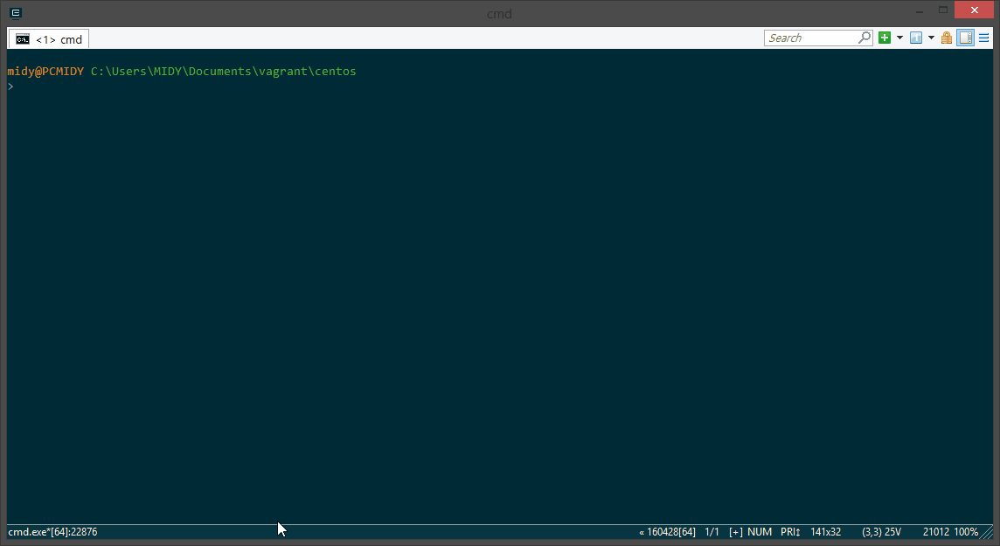

.. Swarm HBase documentation master file, created by
   sphinx-quickstart on Fri Jan 12 15:50:49 2018.
   You can adapt this file completely to your liking, but it should at least
   contain the root `toctree` directive.

Swarm and HBase
===============

================== =============
**Last modified:** |today|
**Copyright**      GMV Aerospace
================== =============

Windows 8.1 scenario
--------------------

Setting docker on Windows 8.1 is tricky. Therefore it is better to set new virtual machine with Linux and provision entire software in form of installed libraries and docker containers.

This process is even more painful if corporate proxy is set up. Proper docker setup is then very, very complex. It is better to use other solution. __Virtualization__.

SWARM mission virtual machine run by vagrant/virtualbox can help to automate this process to great extend. Our Windows machine will be called HOST, while running virtual machine will be GUEST.

Step by step procedure to run VM behind corporate proxy.

.. toctree::
   :maxdepth: 2
   :caption: Contents:

   quickstart
   vagrant
   docker

.. Indices and tables
.. ==================

.. * :ref:`genindex`
.. * :ref:`modindex`
.. * :ref:`search`
